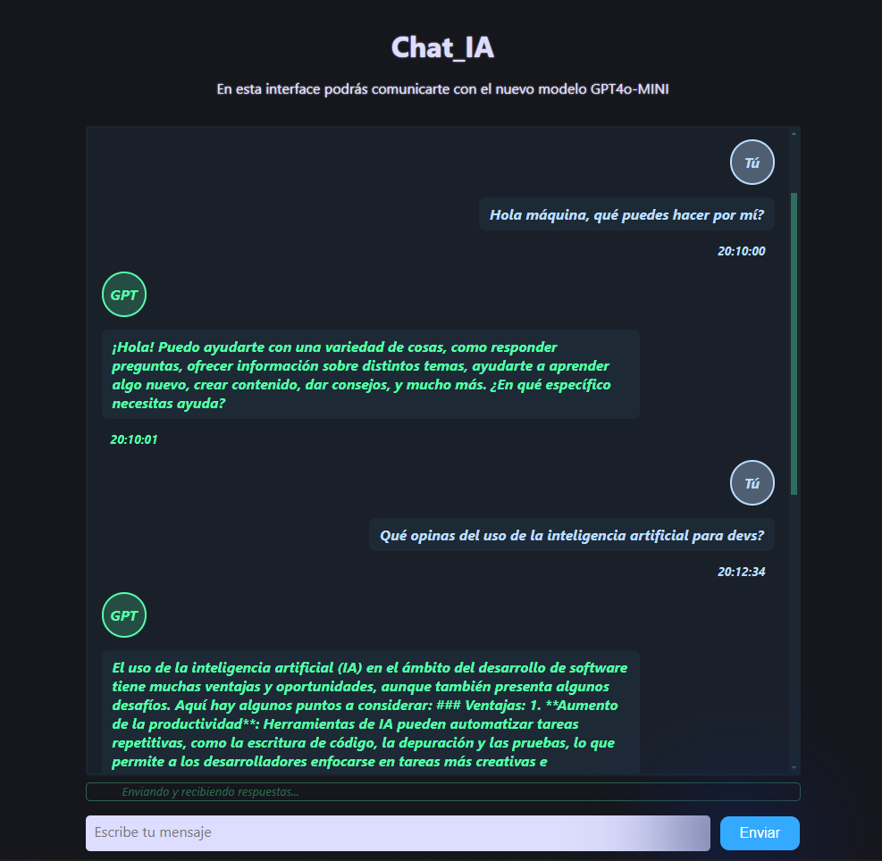

<div align="center">

<h1 style="font-size:38px; background:linear-gradient(90deg, #f30 5%, #111 20% 80%, #f30 95%);color:#f30;border-radius:15px">CHAT_IA</h1>


<h2 style="font-size:26px; background:linear-gradient(180deg, #000 5%, #f30);-webkit-background-clip:text;color:transparent;);font-weight:bold">Chat-bot usando la API de ChatGPT</h2>

<!--<hr style="background:#f50;height:5px;border-bottom: 5px solid #f00;border-radius:25px">-->

<br>

</div>


- **Descargar y descomprimir ZIP.**

- **Crear archivo **.env** en el directorio raiz del proyecto e introducir tu clave** [👉 API Key **↗**](https://platform.openai.com/settings/profile?tab=api-keys) &nbsp; `OPENAI_API_KEY:1234567890`

<br>

- _**Instala :**_
```
$ npm install
```

- _**Arranca el proyecto :**_
```
$ npm start
```

<div align="center">



<br>
<br>

[](https://conancos.dev/portfolio)

</div>
